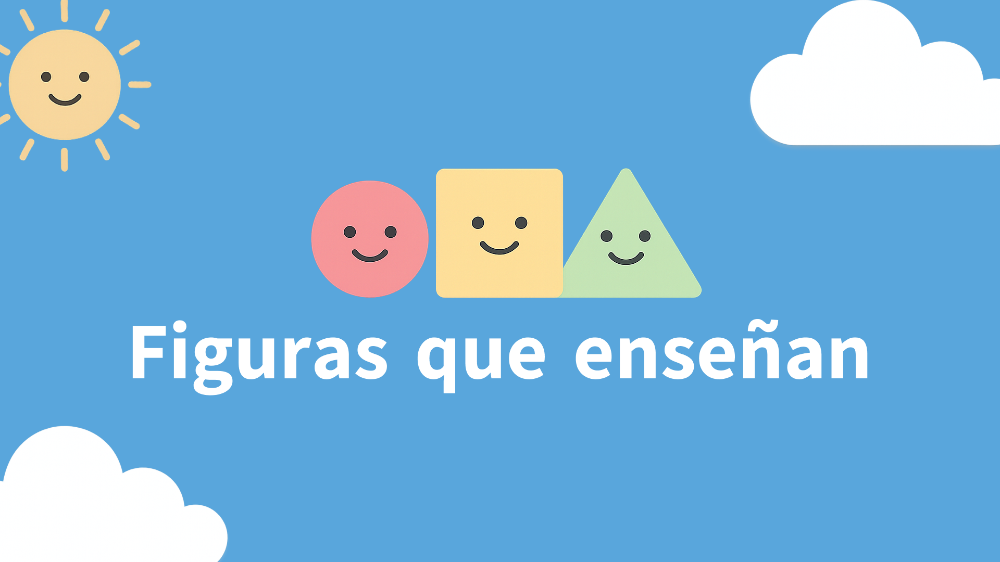

= Figuras Que Enseñan

*Integrantes*

Gabriel Antonio González López zs23014038@estudiantes.uv.mx

Seth Márquez Rodríguez zs23014042@estudiantes.uv.mx

Leonardo Daniel Ortega Teoba zs23014097@estudiantes.uv.mx

*Experiencia Educativa*

Desarrollo De Sistemas En Red

== Definicion del problema

=== Contexto y definición del problema

En etapas tempranas de aprendizaje (preescolar y primaria baja), la suma suele enseñarse mediante ejercicios repetitivos en papel o actividades de memorización. 
Esto provoca que muchos niños logren obtener resultados, pero sin comprender completamente el concepto de suma como *composición de cantidades* (juntar dos grupos para obtener un total). 
Además, en el entorno real existen limitaciones frecuentes: falta de materiales manipulativos, poco tiempo de acompañamiento individual y dificultad para mantener la motivación del niño durante la práctica.

El proyecto propone un sistema educativo que por medio de una historia interactiva enseña a sumar mediante *historias y niveles interactivos*, donde el niño debe representar cantidades con sus dedos. En pantalla se muestran objetivos visuales 
(por ejemplo, círculos que representan unidades) separados por lado izquierdo y derecho. El sistema utiliza detección de manos mediante IA para reconocer en tiempo real la mano izquierda y la mano derecha, así 
como la cantidad de dedos levantados. El nivel se completa cuando el niño alcanza la cantidad correcta en cada mano (ejemplo: 3 dedos en la izquierda y 2 en la derecha), reforzando la suma como unión de dos cantidades.

En términos del método Singapur, el sistema se alinea con el enfoque CPA (Concreto–Pictórico–Abstracto):
* *Concreto:* uso de dedos (manipulación física real).
* *Pictórico:* representación en pantalla mediante figuras (círculos/unidades).
* *Abstracto (opcional o en niveles posteriores):* presentación de la operación simbólica (3 + 2 = 5).

=== Problema principal

*La falta de una herramienta interactiva que permita a los niños aprender y practicar la suma de manera concreta y visual, con retroalimentación inmediata y automática, usando las manos como 
manipulativo real, y guiada por una narrativa por niveles.*

Esto incluye tres necesidades específicas:
. Brindar práctica significativa de suma como composición de cantidades, no solo memorización.
. Mantener motivación mediante historias y progresión por niveles.
. Ofrecer validación y retroalimentación inmediata sin depender de un adulto en todo momento.

=== Contexto de aplicaciones similares

Existen aplicaciones de matemáticas para niños y juegos educativos que ofrecen ejercicios de suma, sin embargo, la mayoría se basa en:
* selección de respuestas por toque/clic (tap-based),
* cuestionarios con opción múltiple,
* arrastre de objetos en pantalla,
* videos o actividades guiadas sin verificación automática del desempeño físico del niño.

En contraste, este proyecto se diferencia porque la interacción principal no es tocar la pantalla, sino *demostrar cantidades con los dedos* y con *mano específica (izquierda/derecha)*, validado por visión por computadora. 
En este enfoque, el sistema no solo presenta ejercicios, sino que detecta la ejecución del niño y entrega retroalimentación en tiempo real basada en lo que realmente hizo con sus manos.

Aunque existen tecnologías de detección de manos (por ejemplo, bibliotecas de visión por computadora), no es común encontrar aplicaciones centradas específicamente en el aprendizaje de suma a través del método CPA usando dedos como manipulativo
 y con una mecánica de niveles narrativos basada en mano izquierda/derecha como representación de sumandos.

=== Consecuencias de no resolver el problema

Si no se aborda este problema, pueden surgir consecuencias educativas y prácticas como las siguientes:

* *Aprendizaje superficial de la suma:* el niño puede resolver ejercicios por repetición sin comprender la idea de juntar cantidades, lo que afecta el avance a temas posteriores (resta, descomposición, llevadas, problemas).
* *Dependencia de memorización:* la práctica se centra en recordar resultados en lugar de construir el concepto, generando errores frecuentes cuando cambian los números o el formato.
* *Falta de retroalimentación inmediata:* sin un adulto disponible, el niño puede practicar incorrectamente y reforzar errores.
* *Baja motivación y abandono:* ejercicios repetitivos sin interacción física o narrativa tienden a ser menos atractivos, disminuyendo el tiempo de práctica.
* *Desigualdad en el aprendizaje:* niños que necesitan más repetición o apoyo individual pueden rezagarse si la práctica depende únicamente del acompañamiento del maestro o familiares.

== Justificación

=== Relevancia del problema

El aprendizaje de la suma en edades tempranas es una habilidad base para el
desarrollo matemático posterior. Cuando un niño aprende a sumar únicamente
por memorización, sin comprender la suma como la unión de cantidades, es
común que aparezcan dificultades más adelante en temas como resta,
descomposición de números, resolución de problemas y operaciones con “llevar”.
Además, en contextos reales (casa o aula), no siempre existe tiempo,
materiales manipulativos o acompañamiento individual suficiente para practicar
de forma correcta y constante.

Este proyecto es relevante porque propone una manera de reforzar la suma
mediante un enfoque más significativo: el niño construye la operación usando
sus dedos (concreto) y la representación visual en pantalla (pictórico),
recibiendo retroalimentación inmediata. Esto puede mejorar la comprensión
conceptual, mantener la motivación y permitir práctica frecuente sin depender
totalmente de un adulto.

=== Oportunidad identificada

Se identifica una oportunidad clara en el uso de visión por computadora para
la educación básica: la mayoría de aplicaciones existentes enseñan sumas
mediante clics, arrastre o cuestionarios, pero no validan automáticamente la
representación física de cantidades con las manos, ni integran el uso de mano
izquierda/derecha como estrategia para formar sumandos dentro de una dinámica
narrativa por niveles.

La combinación de:

historias interactivas,

método Singapur (CPA),

y detección de manos en tiempo real,

abre la oportunidad de crear una herramienta educativa diferenciada: más
inmersiva, más práctica y más cercana a la forma natural en que muchos niños
aprenden (contando con los dedos), pero con evaluación automática y progreso
adaptado. Esto convierte al proyecto en una solución novedosa y con potencial
de impacto educativo tanto para niños neurotipicos como neurodivergentes por medio 
de el acompañamiento guiado de un experto.

== Visión del Sistema

=== Panorama general

El sistema es una herramienta educativa interactiva diseñada para enseñar la
suma a niños mediante niveles tipo historia. Cada nivel presenta objetivos
visuales separados por lado izquierdo y derecho, que representan cantidades.
El niño interactúa mostrandouna cantidad específica de dedos con la mano izquierda y/o derecha,
mientras el sistema utiliza detección de manos por IA para reconocer en tiempo real la
mano y el número de dedos levantados.

El nivel se considera completado cuando el niño cumple las cantidades
requeridas en cada mano durante un tiempo mínimo de estabilidad. El sistema
proporciona retroalimentación inmediata (visual y/o auditiva) para guiar al
niño y mantener la motivación mediante una progresión clara de niveles.

=== Usuarios y roles

* Niño (usuario principal)
** Objetivo: aprender y practicar sumas resolviendo niveles interactivos.
** Acciones: mostrar dedos con mano izquierda/derecha según lo solicitado,
   completar niveles y avanzar en la historia.
** Necesidades: retroalimentación clara, instrucciones simples y experiencia
   motivante.

* Adulto (padre, tutor o docente)
** Objetivo: supervisar y dar seguimiento al progreso del niño.
** Acciones: consultar métricas y reportes (por ejemplo, niveles completados,
   errores frecuentes, tiempo por nivel, número de intentos), identificar
   dificultades y apoyar el proceso de aprendizaje.
** Necesidades: visualización simple del progreso, indicadores claros y
   acceso rápido a resultados por niño.

* Desarrolladores / Administradores del sistema
** Objetivo: monitorear el funcionamiento del sistema y obtener métricas para
   mejorar la experiencia y el rendimiento.
** Acciones: recolectar y analizar métricas de uso (por ejemplo, tiempo que
   tarda en resolverse un nivel, intentos promedio, fallos de detección,
   abandono de niveles), ajustar parámetros y evaluar mejoras.
** Necesidades: métricas confiables, exportación de datos y trazabilidad de
   eventos por nivel/sesión.

=== Estado final ideal

El estado final ideal del sistema es una plataforma estable,atractiva y accesible donde
los niños puedan aprender suma de manera efectiva mediante interacción con
sus manos, con detección precisa en tiempo real y retroalimentación inmediata.
El adulto debe poder visualizar el progreso del niño con indicadores claros,
identificando áreas de mejora y niveles de dificultad. Al mismo tiempo, el
sistema debe generar métricas suficientes para que el equipo de desarrollo
pueda evaluar el desempeño, detectar puntos de fricción (por ejemplo, niveles
demasiado difíciles o lentos) y optimizar continuamente la experiencia
educativa.

== Impacto Esperado

=== Técnico

El sistema busca demostrar que es posible integrar detección de manos por IA en
tiempo real dentro de una aplicación educativa estable y usable, manteniendo
una interacción fluida para niños. A nivel técnico, se espera:

* Reconocimiento consistente de mano izquierda/derecha y conteo de dedos bajo
  condiciones reales (movimiento, iluminación variable, diferentes tamaños de
  mano).
* Retroalimentación inmediata con baja latencia 
* Registro confiable de eventos y métricas por sesión para análisis posterior.
* Escalabilidad del diseño por niveles (nuevos escenarios, dificultad
  progresiva) sin reescribir el núcleo del sistema.

=== Económico / organizacional

El proyecto no está enfocado en generar ganancias masivas. El modelo previsto
es la implementación en centros especializados mediante una licencia única por
uso, priorizando accesibilidad y adopción en entornos educativos que trabajen
con necesidades específicas.

A nivel organizacional, el impacto esperado incluye:

* Facilitar a centros y profesionales una herramienta complementaria de apoyo
  al aprendizaje, con seguimiento objetivo de avances.
* Reducir dependencia de materiales físicos constantes al ofrecer una
  alternativa digital kinestésica con monitoreo de progreso.
* Proveer reportes claros para apoyar decisiones pedagógicas y planes de
  intervención, especialmente en casos donde se requiere seguimiento cercano.

=== Académico o social

El impacto social esperado es ser pioneros en el desarrollo de aplicaciones de
enseñanza fundamentadas en técnicas reales y validadas, no únicamente en
entretenimiento o ejercicios repetitivos. El sistema se apoya en enfoques
pedagógicos como el método Singapur (CPA) y en educación kinestésica y
sensorial, con orientación y respaldo de una maestra especialista en
necesidades especiales con grado de maestría.

Se espera:

* Contribuir a la concientización sobre la importancia de la educación
  kinestésica y sensorial, especialmente en etapas tempranas y en contextos
  de necesidades educativas específicas.
* Ofrecer evidencia y métricas que permitan discutir el impacto de este tipo
  de aprendizaje en el desempeño y la motivación del niño.
* Promover prácticas educativas más inclusivas y centradas en la interacción
  real, no solo en memorización.

== Objetivos de la API

=== Funcionamiento general

El sistema contará con múltiples APIs, cada una con una responsabilidad
específica. En conjunto, permiten la comunicación entre la aplicación (cliente)
y los servicios del sistema, habilitando el seguimiento del aprendizaje, la
gestión de sesiones y la detección de manos en tiempo real.

* API de Sesiones
** Gestiona el ciclo de una sesión de aprendizaje por niño.
** Permite iniciar, pausar, reanudar y finalizar sesiones.
** Registra el progreso por nivel dentro de una sesión.

* API de Métricas
** Registra y consulta métricas generadas durante el uso del sistema.
** Almacena eventos por nivel (inicio, intentos, errores, éxito, abandono).
** Calcula o expone indicadores como tiempo por nivel, intentos promedio,
   desempeño por contenido y progresión.

* API de Detección de Manos (tiempo real)
** Provee la detección de manos en tiempo real para la interacción principal
   del sistema.
** Identifica mano izquierda/derecha y cantidad de dedos levantados.
** Envía resultados al cliente con baja latencia para retroalimentación
   inmediata.

=== Motivación

La motivación de utilizar varias APIs es separar responsabilidades para lograr
un sistema más mantenible, escalable y fácil de mejorar. La detección en tiempo
real requiere baja latencia y procesamiento especializado, mientras que las
sesiones y las métricas requieren persistencia, trazabilidad y reportes.
Dividirlas permite optimizar cada servicio según su función, sin afectar a los
demás.

=== Valor que aporta

La arquitectura con múltiples APIs aporta valor al sistema al:

* Mejorar la estabilidad y el mantenimiento, al separar funciones críticas.
* Permitir escalabilidad independiente: la detección puede escalar por demanda,
  y las métricas pueden optimizarse para almacenamiento y análisis.
* Facilitar el seguimiento del progreso del niño con datos estructurados por
  sesión y por nivel.
* Dar herramientas a adultos para supervisión mediante reportes claros.
* Proveer al equipo de desarrollo métricas reales para iterar niveles, ajustar
  dificultad y mejorar la precisión de detección.
* Hacer viable la implementación en centros especializados, con control de
  acceso por roles y administración de múltiples usuarios.

  == Métricas de Éxito

=== Técnicas

* Precisión de detección de manos
** Porcentaje de acierto en identificar mano izquierda/derecha.
** Porcentaje de acierto en conteo de dedos.

* Latencia de detección en tiempo real
** Tiempo promedio entre movimiento del niño y respuesta del sistema.
** Porcentaje de frames procesados sin retrasos perceptibles.

* Robustez en condiciones reales
** Tasa de fallos por iluminación, oclusión o movimiento.
** Tasa de pérdida de seguimiento (hand tracking lost) por sesión.

* Disponibilidad y estabilidad de servicios
** Uptime de APIs (sesiones, métricas y detección).
** Errores por cada 1000 solicitudes (4xx/5xx) y tiempo de recuperación.

* Rendimiento del sistema
** Tiempo promedio de carga de nivel.
** Consumo promedio de CPU/GPU/memoria en el cliente durante una sesión.

=== De negocio

* Adopción en centros especializados
** Número de centros que implementan el sistema.
** Número de licencias activas (licencia única por centro).

* Uso real del sistema
** Número de niños registrados por centro.
** Sesiones promedio por niño a la semana.
** Tiempo promedio de uso por sesión.

* Retención y continuidad
** Porcentaje de niños que regresan a usar el sistema después de la primera
   semana y del primer mes.
** Porcentaje de niveles completados vs. abandonados.

* Satisfacción del usuario adulto (tutor/docente)
** Encuestas de satisfacción sobre utilidad de reportes y facilidad de uso.
** Frecuencia de consulta de métricas por parte del adulto.

=== De calidad

* Progreso de aprendizaje
** Reducción del tiempo promedio para completar un nivel con práctica.
** Disminución de intentos promedio por nivel a lo largo del tiempo.
** Aumento del porcentaje de aciertos sin pistas.

* Calidad pedagógica percibida
** Evaluación cualitativa por parte de la maestra especialista (y/o docentes)
   sobre alineación con método Singapur y aprendizaje kinestésico/sensorial.

* Experiencia del niño
** Nivel de frustración medido por abandonos y reintentos consecutivos.
** Indicadores de motivación: continuidad de niveles, tiempo voluntario de uso.

* Calidad de retroalimentación
** Porcentaje de correcciones/pistas que conducen a éxito en el siguiente
   intento.
** Frecuencia de “falsos errores” (el niño lo hace bien pero el sistema marca
   mal) reportados o detectados por métricas.